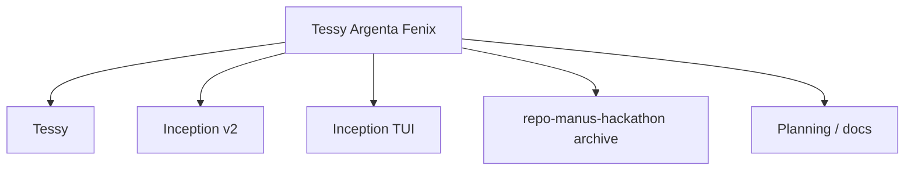

# Tessy Argenta Fenix

**Hub master do ecossistema Rabelus**

Tessy Argenta Fenix is the global repository that orients the ecosystem, connects the module repositories, and presents the project as a single landing surface.

## O que este repositório é

- **Master repo** do superprojeto.
- **Landing page** do ecossistema.
- **Índice** dos repositórios individuais, sem sobrescrever os módulos originais.
- **Arquivo visual** com ativos reaproveitados do `repo-manus-hackathon`.

## Repositórios que continuam independentes

- [Tessy - Antigravity Version](https://github.com/rabelojunior81-collab/tessy-antigravity-rabelus-lab)
- [repo-manus-hackathon](https://github.com/rabelojunior81-collab/repo-manus-hackathon)
- Inception v2
- inception-tui

## Landing page

A experiência visual principal vive em [`index.html`](./index.html) e usa o pacote de ativos arquivado em [`brand/repo-manus-hackathon`](./brand/repo-manus-hackathon).

## Arquitetura de alto nível

## Conteúdos em destaque

- Landing page com visual glassmorphic.
- Catálogo local dos ativos visuais do hackathon.
- Documento de auditoria holística.
- Licença, contribuição, segurança e código de conduta.

## Como explorar

1. Abra [`index.html`](./index.html) no navegador.
2. Navegue pelos ativos em [`brand/repo-manus-hackathon`](./brand/repo-manus-hackathon).
3. Leia [`docs/auditoria_holistica_2026-04-22.md`](./docs/auditoria_holistica_2026-04-22.md).

## Nota

Este repositório master foi desenhado para coordenar o ecossistema sem tocar nos repositórios individuais. O objetivo é fornecer visão global, documentação e uma landing page pública ou semi-pública para o projeto.
